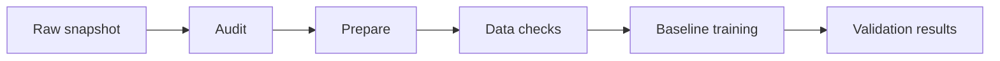

# Milestone 2 report draft

SafeAgent is a TAED2 project by David González, Joel Márquez, Pau Balaguer and
Pau González. Its goal is to classify proposed shell commands as ALLOW, ASK or
DENY and study whether execution context improves that classification.
The component reads text and never executes the proposed commands.

The project links are the
[GitHub repository](https://github.com/taed2-2627q1-gced-upc/taed2-SafeAgent) and
[DagsHub project](https://dagshub.com/Pau-Balaguer/taed2-SafeAgent).
Team contact details, the coordination board link and contribution assessment
still need confirmation before submission. This document is a report draft,
so it does not claim that the team assessment or presentation is complete.

## Problem and comparison

A command can have a different risk depending on its working directory,
repository state and recent user request. The main comparison therefore keeps
the model family and prepared split fixed while changing the input mode.
Comparing a command model against a different context model would mix the
effect of context with the effect of the model.

The first model uses character TF-IDF and a linear SVM. CodeBERT and ModernBERT
have a shared training implementation, and both have command and command with
context runs planned. Their complete fitted results are still pending.
The [model cards](model-cards/index.md) describe each model and its limits.

## Data and leakage checks

The dataset is [Shell Safety v1.1](https://huggingface.co/datasets/tomngdev/shell-safety-v1.1).
Its source revision is fixed in params.yaml and the raw snapshot stays unchanged.
The audit found 34,007 source rows. Preparation removed 680 redundant copies and
quarantined two examples with conflicting labels, leaving 33,325 examples.

| Partition | Examples | Role |
| --- | ---: | --- |
| Train | 26,660 | Fit the model and training vocabulary |
| Validation | 3,333 | Compare settings and select encoder epochs |
| Test | 3,332 | Reserved for the final comparison |

The split keeps related commands and duplicate groups together. Both input modes
use exactly the same prepared examples. Command inputs contain only the command,
while the context mode adds the approved context fields through the shared input
builder. Labels, annotation reason, category, assistant text, shell tags and
identifiers do not become predictive features.

Great Expectations checks the dataset contract and Deepchecks checks conflicting
labels and overlap between partitions. These checks reduce leakage, but the data
is synthetic and near duplicate checks cannot prove that it covers real command
risk. Context timing is also not fully documented, so assistant text is excluded.
The [dataset card](dataset-card.md) records the full protocol and known limits.

## Code and pipeline

Reusable code lives in taed2_safeagent, with separate modules for preparation,
input building, training, evaluation and tracking. params.yaml stores the
settings, while pyproject.toml and uv.lock define the environment.
Notebooks and cloud scripts call package functions instead of duplicating the
model logic. Unused plotting and notebook placeholders were removed.

The baseline pipeline follows these stages:



Training depends on the quality report, prepared data, source and settings.
A failed stage stops the following stages. Current outputs can be reused through
DVC, and model metadata keeps the source that actually produced those outputs.
Normal reproduction does not create a new MLflow run.

## Versioning and experiments

GitHub stores code, settings, dependency locks, DVC metadata and small reports.
DagsHub stores the larger datasets and fitted models through DVC, and also hosts
the shared SafeAgent MLflow experiment. Git history is kept on GitHub.

Changes use focused commits on feature branches and pull requests for review.
The model has one DVC owner in the train stage, so its version is recorded in
dvc.lock. A clean recovery check downloaded the model with a fresh cache and
evaluated it successfully.

An explicit experiment command fits the baseline, evaluates validation, uploads
the new model and records its metrics and reports in MLflow. The shared run
links the source used during fitting with the input data version and saved model.
Generated output metadata is committed afterward, keeping those two steps clear.

The [recorded baseline run](https://dagshub.com/Pau-Balaguer/taed2-SafeAgent.mlflow/#/experiments/1/runs/80c83cb3105a428db83b5038ab37c0ec)
completed successfully. Its settings, class results, confusion matrices and
aligned predictions are available with the run, while the model binary stays in
DVC. The [baseline guide](baseline.md) explains the commands and saved files.

## First validation result

| Metric | Result |
| --- | ---: |
| Accuracy | 0.8623 |
| Macro F1 | 0.8613 |
| DENY recall | 0.8613 |
| DENY predicted ALLOW | 19 of 764 |
| DENY to ALLOW rate | 2.49% |

The baseline gives a useful comparison point and its saved model is about 2 MB.
The false allow errors remain important even when the overall score is reasonable.
These are validation results from synthetic data, and the test partition has not
been used to select the model.

## Reproduction and checks

The [setup guide](getting-started.md) explains DVC access. From the project root:

```sh
uv sync --frozen --group data --group dev --group training
uv run --frozen --group data dvc pull
uv run --frozen --group data dvc repro
uv run --frozen --group data pytest -q
```

Pytest covers data handling, model behavior, tracking failures and small encoder
architectures. Pylint and Ruff check the code, and the docs build uses strict
mode. GitHub Actions runs these checks in one job without personal storage
credentials. PyNBLint checked the Kaggle notebook and reported that it is
unexecuted, along with missing metadata in the notebook folder scan.

## Retrospective and next work

The first tasks focused on a recoverable dataset and one complete baseline,
because these provide a stable starting point for the larger models. Keeping
shared logging explicit avoids confusing cached results with new experiments.
The project also keeps its setup small, with maintainability as the main priority.

Kaggle GPU access has been verified. Full encoder fitting, result registration
and the paired context comparison remain pending. Encoder training includes
CodeCarbon, but actual energy results must come from completed fitting and retain
their sensor and location assumptions. Those measurements and further model
quality checks are Milestone 3 work.

Before submission, the team still needs to confirm contact and coordination
details, complete its contribution assessment and review the report and
[presentation outline](milestone-2-presentation.md).
